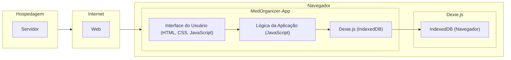

# Arquitetura da Solução

Pré-requisitos: <a href="3-Projeto de Interface.md"> Projeto de Interface</a>

Arquitetura do projeto MedOrganizer (front-end)

O projeto MedOrganizer é uma aplicação web simples para gerenciar informações médicas, como pacientes, medicamentos, médicos, clínicas, laboratórios e agendamentos. A aplicação utiliza o Dexie.js como uma camada de abstração para o IndexedDB, permitindo armazenamento e gerenciamento de dados localmente no navegador.

Componentes do sistema:

1. Interface do usuário (UI)
2. Lógica de aplicação
3. Armazenamento e gerenciamento de dados

A arquitetura do projeto é dividida em três partes principais:

1. **Interface do usuário (UI)**: A interface do usuário é construída usando HTML, CSS e JavaScript para criar a estrutura, estilização e interatividade da aplicação. A UI permite aos usuários inserir, atualizar e excluir informações médicas, além de visualizar dados em tabelas e campos de entrada.

2. **Lógica de aplicação**: A lógica de aplicação é implementada usando JavaScript puro e consiste em funções e event listeners para manipular ações do usuário e interagir com o armazenamento de dados. As classes e funções são usadas para representar e gerenciar entidades como Paciente, Medicamento, Médico, ClínicaLaboratório e Agendamento.

3. **Armazenamento e gerenciamento de dados**: A camada de armazenamento e gerenciamento de dados é construída usando o Dexie.js, uma biblioteca de abstração para o IndexedDB. O Dexie.js simplifica o uso do IndexedDB, permitindo a criação de um banco de dados local no navegador e realizando operações CRUD (Criar, Ler, Atualizar, Deletar) de maneira simples e eficiente.

## Diagrama de componentes

Diagrama que permite a modelagem física de um sistema, através da visão dos seus componentes e relacionamentos entre os mesmos.

Exemplo: 

Os componentes que fazem parte da solução são apresentados no Diagrama 01

Diagrama 01 - Arquitetura da Solução

A solução implementada conta com os seguintes módulos:
- **Navegador** - Interface básica do sistema  
  - **Páginas Web** - Conjunto de arquivos HTML, CSS, JavaScript e imagens que implementam as funcionalidades do sistema.
   - **Local Storage** - armazenamento mantido no Navegador, onde são implementados bancos de dados baseados em IndexedDB. São eles: 
     - Pacientes 
     - Medicamentos
     - Médicos
     - Clínicas/Laboratórios
     - Agendamentos
 - **Hospedagem** - local na Internet onde as páginas são mantidas e acessadas pelo navegador. 

> **Links Úteis**:
>
> - [Whimsical](https://whimsical.com/)

## Tecnologias Utilizadas

Tecnologias e ferramentas envolvidas:

1. HTML5: para criar a estrutura da aplicação
2. CSS3: para estilização e design da interface do usuário
3. JavaScript (ECMAScript 5): para lógica de aplicação e interação com a interface do usuário
4. Dexie.js: para simplificar o uso do IndexedDB e gerenciar o armazenamento de dados localmente no navegador
5. IndexedDB: para armazenar dados localmente no navegador
6. IDEs de desenvolvimento: Visual Studio Code, Sublime Text, Atom ou qualquer outro editor de texto adequado para desenvolvimento web
7. Ferramentas de controle de versão (opcional): Git e GitHub para gerenciamento de código-fonte e colaboração

A arquitetura do projeto MedOrganizer foi projetada para ser simples e fácil de entender, sem o uso de módulos ES6. As tecnologias e ferramentas escolhidas permitem a implementação de uma solução de armazenamento de dados local no navegador e gerenciamento de informações médicas com uma interface de usuário intuitiva.

> Apresente também uma figura explicando como as tecnologias estão relacionadas ou como uma interação do usuário com o sistema vai ser conduzida, por onde ela passa até retornar uma resposta ao usuário.

## Hospedagem

Explique como a hospedagem e o lançamento da plataforma foi feita.

> **Links Úteis**:
>
> - [Website com GitHub Pages](https://pages.github.com/)
> - [Programação colaborativa com Repl.it](https://repl.it/)
> - [Getting Started with Heroku](https://devcenter.heroku.com/start)
> - [Publicando Seu Site No Heroku](http://pythonclub.com.br/publicando-seu-hello-world-no-heroku.html)